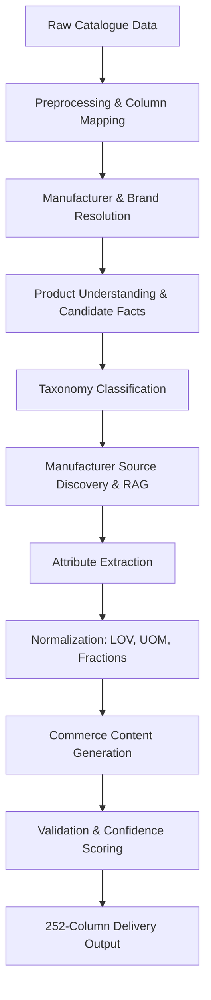

# 🏭 AI Product Intelligence Pipeline

<div align="center">
  <p><strong>Transforming messy industrial catalogue data into standardized, searchable, and commerce-ready product records.</strong></p>
</div>

---

##  Overview

The **AI Product Intelligence Pipeline** is an end-to-end data processing and intelligence system that takes raw, unstructured product catalog data and enriches it into a verified 252-column commerce-ready delivery format. 

This project tackles the challenge of messy industrial product descriptions by passing them through a three-stage intelligent pipeline:

1. ** Product Intelligence:** Entity resolution, classification, and Retrieval-Augmented Generation (RAG) to discover and pull data from manufacturer sources.
2. ** Data Normalization & Validation:** Deterministic validation against strict rule-based engines (UOM standards, fractional limits, Lists of Values), ensuring high confidence scoring.
3. ** Content Generation & Presentation:** Translating verified facts into commerce-ready, human-readable descriptions, showcased in an intuitive Next.js Review UI.

## Architecture

The pipeline follows a robust, multi-layered architecture:



## Tech Stack

- **Core & Data Processing:** Python 3.10+, pandas
- **Document Processing (RAG):** PyMuPDF (`fitz`)
- **AI & LLM Orchestration:** Anthropic/OpenAI APIs (via Instructor), Pydantic for structured extraction
- **API Backend:** FastAPI, SQLite, Uvicorn
- **Frontend / Review UI:** Next.js 14, React, Tailwind CSS

## Getting Started

### Prerequisites

- **Python 3.10+**
- **Node.js 18+** & npm
- Valid LLM API Keys (Groq / Anthropic / OpenAI)

### 1. Installation & Backend Setup

Clone the repository and set up your Python environment:

```bash
git clone https://github.com/your-org/AI-Product-Intelligence.git
cd AI-Product-Intelligence

# Create and activate a virtual environment
python -m venv venv
# On Windows:
venv\Scripts\activate
# On macOS/Linux:
source venv/bin/activate

# Install dependencies
pip install -r requirements.txt
```

### 2. Environment Configuration

Copy the example environment file and add your required API keys (e.g., Groq API key for LLM-assisted extraction).

```bash
cp .env.example .env
```
*Edit `.env` to configure your specific API keys.*

### 3. Frontend Setup

Install the dependencies for the Review UI:

```bash
cd frontend
npm install
cd ..
```

---

##  Usage Guide

The system can be used via its CLI pipeline for bulk processing, or interactively via the API and Frontend.

### 1. Running the CLI Pipeline

The core processing engine is executed via `run_pipeline.py`. It takes your raw input data and outputs the standardized 252-column CSV.

```bash
python run_pipeline.py \
    --input data/raw/input.csv \
    --output data/processed/output.csv \
    --master data/reference/UniCat_Manufacturer_and_Brand_List.xlsx \
    --limit 200 \
    --workers 5
```

**Parameters:**
- `--input`: Path to raw catalogue input CSV (requires 6 core columns)
- `--output`: Path to write the 252-column delivery CSV
- `--master`: Path to manufacturer/brand master reference data (optional)
- `--limit`: Only process the first N rows (useful for testing)
- `--workers`: Number of concurrent processing threads
- `--internal-json`: Optional path to dump the rich internal product JSON for frontend hydration.

*(Windows users can also use the provided `run_prod.ps1` helper script).*

### 2. Running the API Backend

To serve the processed data and interact with the intelligence endpoints, start the FastAPI server:

```bash
uvicorn api.main:app --reload
```

### 3. Running the Review UI

In a separate terminal, launch the Next.js frontend to visualize the pipeline results, review confidence scores, and interact with the data:

```bash
cd frontend
npm run dev
```
Navigate to `http://localhost:3000` in your browser.

---

##  Project Structure & Team Workflow

The repository is structured to support our vertical ownership model while maintaining strict integration points:

- `src/preprocessing/` - Data ingestion, column normalisation
- `src/rag/` - Source discovery, document parsing, retrieval
- `src/attributes/` - Schema definitions, LLM extraction mappers
- `src/normalization/` - Deterministic LOV, UOM, and fraction rules
- `src/validation/` - Rules engine, character limits, confidence scoring
- `src/pipeline/` - Orchestration (connecting AI, Normalisation, and Output)
- `frontend/` - Next.js UI for product review
---

## T1 — Input Intelligence

### Tasks

- Understand the six raw input fields:
  - `Mfg_Part_Num`
  - `Part_Desc`
  - `E1_Brand`
  - `Unilog_Brand`
  - `DIB_Brand`
  - `Part_Manuf`
- Work with the cleaned `ProductInput` object.
- Identify useful semantic information in abbreviated descriptions.
- Preserve row IDs for traceability.

### Output

```python
ProductInput(
    mfg_part_num=...,
    part_desc=...,
    e1_brand=...,
    unilog_brand=...,
    dib_brand=...,
    part_manuf=...
)
```

---

# T2 — Manufacturer Resolution

### Reference

`UniCat_Manufacturer_and_Brand_List.xlsx`

### Pipeline

```text
Raw Manufacturer
      ↓
String Cleaning
      ↓
Exact Match
      ↓
Normalized Match
      ↓
Fuzzy Match
      ↓
Candidate Ranking
      ↓
LLM Disambiguation if necessary
      ↓
Canonical Manufacturer
```

### Output

```json
{
  "manufacturer_name": "Canonical Manufacturer",
  "manufacturer_code": "...",
  "confidence": 0.97,
  "method": "fuzzy_match"
}
```

### Requirements

- Never invent manufacturer names.
- Prefer exact/normalized matches.
- Use fuzzy matching for messy strings.
- Use LLM only when deterministic matching is ambiguous.
- Flag low-confidence matches for review.

---

# T3 — Brand Resolution

Use the same manufacturer/brand master.

Pipeline:

```text
Raw Brand
   ↓
Clean
   ↓
Exact / Fuzzy Match
   ↓
Canonical Brand
   ↓
Brand Code
```

Handle placeholders such as:

```text
-- Unbranded --
-- No Unilog Brand --
-- No DIB Brand --
```

as empty values.

---

# T4 — Product Understanding

## Goal

Understand cryptic descriptions.

Example:

```text
3/8 CPLG BRS 150#
```

should become an intermediate representation such as:

```text
Product Type: Coupling
Size: 3/8
Material: Brass
Pressure: 150
```

These are **candidate facts**, not yet final normalized values.

### Why this layer exists

The representation will be consumed by:

- classification
- RAG query generation
- attribute extraction
- content generation

---

# T5 — Classification

Determine:

```text
Dept
Class
Fine
Classpath
```

### Pipeline

```text
Product Understanding
       ↓
Candidate Classes
       ↓
Controlled Vocabulary
       ↓
Semantic Matching
       ↓
LLM Ranking
       ↓
Final Classpath
       ↓
Confidence
```

### Important

The LLM must not invent arbitrary taxonomy values.

The final result must map to the supplied taxonomy/reference data.

---

# T6 — Manufacturer Source Discovery

## Goal

Find authoritative manufacturer information.

Preferred sources:

```text
1. Manufacturer official website
2. Manufacturer product page
3. Manufacturer specification sheet
4. Manufacturer installation manual
5. Manufacturer catalogue
6. Manufacturer technical documentation
```

Avoid marketplace/distributor sources when the challenge's sourcing rules exclude them.

---

## Query Generation

For each product, create several retrieval queries:

```text
<MPN> specifications
<MPN> dimensions
<MPN> installation manual
<MPN> technical data
<MPN> <product type>
```

---

# T7 — RAG Pipeline

## Main RAG Architecture

```text
Product
   ↓
Query Generation
   ↓
Manufacturer Source Discovery
   ↓
Document Download
   ↓
Parsing
   ↓
Cleaning
   ↓
Chunking
   ↓
Embeddings
   ↓
Vector Store
   ↓
Top-K Retrieval
   ↓
Reranking
   ↓
Relevant Evidence
```

---

## Source Metadata

Every retrieved chunk should retain:

```json
{
  "source_url": "...",
  "manufacturer": "...",
  "mpn": "...",
  "document_type": "specification_sheet",
  "page": 3
}
```

This allows the final system to answer:

> Where did this product attribute come from?

---

# T8 — RAG-Grounded Attribute Support

RAG should not directly decide the final output.

Instead:

```text
RAG
 ↓
Evidence
 ↓
LLM Extraction
 ↓
Candidate Attribute
 ↓
Yashas' Normalization
 ↓
Validation
```

Example:

```json
{
  "label": "Voltage Rating",
  "candidate_value": "120",
  "candidate_uom": "V",
  "source": "manufacturer_spec.pdf",
  "page": 3
}
```

---

# T9 — Pipeline Orchestration

Tanush owns the high-level orchestration:

```text
src/pipeline/
├── orchestrator.py
└── batch.py
```

The orchestrator connects all three team members' modules.

```text
Input
 ↓
Preprocess
 ↓
Entity Resolution
 ↓
Product Understanding
 ↓
Classification
 ↓
RAG
 ↓
Attribute Extraction
 ↓
Normalization
 ↓
Content
 ↓
Validation
 ↓
Output
```

---

# 5. YASHAS — Data Intelligence, Normalization, Validation & Evaluation

## Main Goal

> **Make the AI output conform to Unilog's controlled data standards and prove that it is correct.**

Yashas owns the deterministic correctness layer.

---

# Y1 — Dataset Mapping

Create:

```text
docs/
├── dataset_map.md
├── output_schema.md
└── field_groups.md
```

Map all 252 output columns into logical groups.

Recommended groups:

```text
1. Identity
2. Manufacturer / Brand
3. Classification
4. Descriptions
5. Attributes
6. Dimensions
7. Commercial Fields
8. Compliance
9. Digital Assets
10. Source / Metadata
```

---

# Y2 — Field Transformation Matrix

For each important field, document:

```text
Field
Purpose
Source
Transformation
Reference
Validation
Priority
```

Example:

| Field | Source | Method | Validation |
|---|---|---|---|
| Manufacturer | Input + Master | Entity Resolution | Master list |
| Brand | Input + Master | Entity Resolution | Master list |
| Material | RAG | Extraction + LOV | LOV |
| UOM | RAG/Input | Deterministic | UOM master |
| Product Title | Attributes | LLM + Rules | Character limit |
| Long Description | Attributes + RAG | LLM | Guidelines |

---

# Y3 — LOV Engine

Reference:

`Unicat_Lov_v1_0_Updated_With_Remarks.xlsx`

Build:

```text
src/normalization/lov.py
```

### Tasks

- Load LOV data.
- Normalize attribute labels.
- Normalize attribute values.
- Handle approved synonyms.
- Map supplier values to canonical values.
- Reject invalid values.
- Support category-specific LOVs.
- Support Fittings many-to-one mappings.
- Support Faucets category rules.

---

## Example

```text
SS
SST
Stainless-steel
Stainless Steel
       ↓
Stainless Steel
```

Only make this mapping if the reference data supports it.

---

# Y4 — UOM Engine

Reference:

`Unilog_Master_UOM_Standards_Abbreviations_and_Terms.xlsx`

Build:

```text
src/normalization/uom.py
```

### Tasks

- Load approved UOMs.
- Parse numeric values.
- Normalize unit names.
- Convert units when necessary.
- Enforce formatting.
- Validate UOM against the approved master.

Example:

```text
24 inches
24 IN.
24 inch
      ↓
24 in
```

UOM transformations should be deterministic rather than delegated to an LLM.

---

# Y5 — Fraction Engine

Reference:

`Decimal_Fraction.xlsx`

Build:

```text
src/normalization/fractions.py
```

Examples:

```text
0.5 in
→
1/2 in
```

```text
0.375 in
→
3/8 in
```

```text
50.25 in
→
50-1/4 in
```

---

# Y6 — Attribute Schema and Normalization

Build:

```text
src/attributes/
├── schema.py
├── extractor.py
└── mapper.py
```

Attribute object:

```json
{
  "label": "Material",
  "value": "Stainless Steel",
  "uom": null,
  "source": "manufacturer_spec.pdf",
  "source_page": 3,
  "confidence": 0.94,
  "needs_review": false
}
```

---

# Y7 — Validation Engine

Build:

```text
src/validation/
├── rules.py
├── character_limits.py
├── grounding.py
└── validator.py
```

Validate:

### LOV

```text
Is the value approved?
```

### UOM

```text
Is the UOM approved?
```

### Character limits

```text
Does the generated content fit?
```

### Casing

```text
Does the field follow the required casing?
```

### Completeness

```text
Are required fields present?
```

### Grounding

```text
Does the factual statement have supporting evidence?
```

---

# Y8 — Confidence and Review Flags

Create deterministic confidence adjustments.

Potential signals:

```text
Manufacturer match
Classification confidence
Retrieval score
Attribute extraction confidence
LOV match
UOM validity
Source availability
Validation result
```

Possible statuses:

```text
HIGH
MEDIUM
LOW
NEEDS_REVIEW
```

---

# Y9 — Evaluation Framework

Reference:

`Unilog-Sample_200_Items-Input-vs-Output.xlsx`

Build:

```text
src/evaluation/
├── metrics.py
├── field_accuracy.py
├── grounding.py
└── report.py
```

Measure:

```text
Manufacturer accuracy
Brand accuracy
Classification accuracy
Attribute accuracy
LOV compliance
UOM compliance
Character compliance
Grounding rate
Review rate
```

---

# Y10 — Output Assembly

Build:

```text
src/output/
├── mapper.py
└── exporter.py
```

Responsibilities:

- Preserve exact expected headers.
- Preserve exact column order.
- Map internal Product → 252 columns.
- Handle missing values.
- Export CSV/XLSX.
- Verify schema before writing.

---

# 6. VEDANTH — Content Generation, Frontend, Review & Product Experience

## Main Goal

> **Turn verified product intelligence into commerce-ready content and make the complete system easy for a judge to understand.**

---

# V1 — Internal Product → UI Schema

Frontend should consume a clean representation rather than the raw 252 columns.

```text
Product
├── Identity
├── Manufacturer
├── Brand
├── Classification
├── Attributes
├── Descriptions
├── Sources
├── Confidence
├── Validation
└── Review
```

---

# V2 — Content Generation

Build:

```text
src/content/
├── invoice.py
├── mobile.py
├── title.py
├── long_description.py
├── marketing.py
└── features.py
```

---

# V3 — Invoice Description

Follow the supplied content guidelines.

Enforce:

- character limits
- uppercase rules
- approved abbreviations
- construction formula

---

# V4 — Mobile Description

Generate according to the specified length.

Input:

```text
Verified product
+
Verified attributes
+
Manufacturer evidence
```

Do not generate unsupported facts.

---

# V5 — Product Title / Short Description

Use the required construction logic.

Example structure:

```text
Brand
+
Series
+
MPN
+
Item Type
+
Key Attributes
```

Example:

```text
FRIGIDAIRE® Professional Series PDSH4816AF Dishwasher With CleanBoost™
```

The actual formula must come from the supplied guidelines.

---

# V6 — Long Description

Use verified attributes and manufacturer evidence.

Example structure:

```text
Brand
+
Product Type
+
Series
+
Key Features
+
Important Specifications
+
Dimensions
+
Material
```

No unsupported claims.

---

# V7 — Marketing Content

Generate:

```text
Marketing Description
Feature 1
Feature 2
...
```

Only from:

```text
verified attributes
+
manufacturer evidence
+
content guidelines
```

---

# V8 — Frontend Dashboard

Build:

```text
frontend/
├── dashboard
├── products
├── review
├── sources
└── components
```

Dashboard should show:

```text
Products Processed
High Confidence
Needs Review
Validation Failures
Grounding Rate
```

---

# V9 — Product Detail

Display:

```text
Product Identity
Manufacturer
Brand
MPN
Classification
```

Then:

```text
Attributes
```

Example:

```text
Voltage       120 V          ✓
Amperage      15 A           ✓
Material      Stainless Steel ✓
Wash Cycles   5              ✓
Sound Level   47 dBA         ✓
```

---

# V10 — Evidence Viewer

Clicking an attribute should reveal:

```text
Source
Manufacturer Specification Sheet
Page 3
```

and the relevant evidence.

This is how the RAG contribution becomes visible to judges.

---

# V11 — Human Review

Allow:

```text
Accept
Edit
Reject
```

Example:

```text
Material
────────────────────
AI Value: Stainless Steel
Confidence: 74%

⚠ Needs Review

[Accept] [Edit] [Reject]
```

---

# V12 — Metrics Dashboard

Display actual measured evaluation results.

Example layout:

```text
200 Ground-Truth Products

Field Accuracy       XX.X%
LOV Compliance       XX.X%
UOM Compliance       XX.X%
Character Compliance XX.X%
Grounding Rate       XX.X%
Review Rate           XX.X%
```

Never hardcode demonstration numbers.

---

# 7. SHARED RESPONSIBILITIES

The following work is intentionally shared equally.

---

## Shared 1 — Dataset Understanding

All three inspect:

```text
Reference_Documents_Summary
200-row Input
200-row Delivery Format
1000-row Input
```

Each person studies the fields relevant to their area.

---

## Shared 2 — 200-Row Testing

Split the 200 labelled rows:

```text
Tanush   → Rows 1–67
Yashas   → Rows 68–134
Vedanth  → Rows 135–200
```

Each person records:

```text
Expected
Actual
Error
Reason
Suggested Fix
```

---

## Shared 3 — Integration

All three participate in integration.

```text
Tanush
AI + RAG
      ↓
Yashas
Normalization + Validation
      ↓
Vedanth
Content + UI
```

---

## Shared 4 — Final Demo

### Tanush

Explains:

```text
Product Understanding
RAG
Manufacturer Evidence
```

### Yashas

Explains:

```text
LOV
Normalization
Validation
Metrics
```

### Vedanth

Explains:

```text
Generated Content
UI
Human Review
Final Output
```

---

# 8. Equal Development Timeline

## Stage 1 — Foundation

### All

```text
Inspect datasets
        ↓
Map 252 columns
        ↓
Define internal schema
        ↓
Select deep-demo category
```

---

## Stage 2 — Parallel Development

### Tanush

```text
Entity Resolution
        ↓
Product Understanding
        ↓
Classification
        ↓
Source Discovery
        ↓
RAG
```

### Yashas

```text
Field Mapping
        ↓
LOV
        ↓
UOM
        ↓
Fractions
        ↓
Attribute Schema
        ↓
Validation
```

### Vedanth

```text
Content Templates
        ↓
Product UI
        ↓
Source UI
        ↓
Review UI
```

---

# 9. Integration Checkpoint 1

Connect:

```text
Tanush
Product Intelligence

+

Yashas
Normalization

+

Vedanth
Content
```

Expected result:

```text
Raw Row
 ↓
Structured Product
 ↓
Normalized Attributes
 ↓
Generated Content
```

---

# 10. Integration Checkpoint 2 — RAG

```text
Product
 ↓
Tanush RAG
 ↓
Manufacturer Evidence
 ↓
Yashas Validation
 ↓
Vedanth Evidence UI
```

At this point the team can demonstrate:

> This attribute was not invented; it was retrieved from a manufacturer source and normalized against the controlled vocabulary.

---

# 11. Integration Checkpoint 3 — Validation

```text
Generated Product
       ↓
Validation
       ↓
Confidence
       ↓
Needs Review?
       ↓
Review UI
```

---

# 12. Integration Checkpoint 4 — 200 Rows

Run the complete system on the 200 labelled records.

```text
200 Input
   ↓
Pipeline
   ↓
Expected vs Actual
   ↓
Metrics
   ↓
Error Analysis
```

Do not move to the 1,000-row dataset until this pipeline is stable.

---

# 13. Integration Checkpoint 5 — 1,000 Rows

Run:

```text
1000 raw catalogue rows
```

Measure:

```text
Total processing time
Success rate
Review rate
Validation failures
Missing sources
Average confidence
```

---

# 14. Git Strategy

Branches:

```text
main
│
├── tanush/intelligence-rag
├── yashas/normalization-validation
└── vedanth/content-frontend
```

Integration:

```text
integration
```

Workflow:

```text
Feature
 ↓
Local Tests
 ↓
Pull Request
 ↓
Integration
 ↓
200-Row Regression
 ↓
Merge
```

Do not push untested changes directly into `main`.

---

# 15. Definition of Done — Tanush

```text
[ ] Manufacturer resolution works
[ ] Brand resolution works
[ ] Product understanding works
[ ] Classification works
[ ] Manufacturer source discovery works
[ ] Documents can be parsed
[ ] RAG indexing works
[ ] Retrieval works
[ ] Source metadata is preserved
[ ] Evidence can be passed to attribute extraction
[ ] Pipeline orchestration works
```

---

# 16. Definition of Done — Yashas

```text
[ ] 252 fields mapped
[ ] LOV loaded
[ ] Category LOV loaded
[ ] UOM standards loaded
[ ] Fraction lookup works
[ ] Attribute normalization works
[ ] Validation rules work
[ ] Confidence/review rules work
[ ] 200-row evaluation works
[ ] Accuracy metrics generated
[ ] Output mapper works
[ ] Exact expected headers preserved
```

---

# 17. Definition of Done — Vedanth

```text
[ ] Invoice description generation works
[ ] Mobile description generation works
[ ] Product title generation works
[ ] Long description generation works
[ ] Marketing content works
[ ] Product dashboard works
[ ] Product detail page works
[ ] Attribute evidence is visible
[ ] Confidence is visible
[ ] Review actions work
[ ] Metrics dashboard works
[ ] Export is accessible from UI
```

---

# 18. Final Evaluation Metrics

The final presentation should show measured metrics.

## Field Accuracy

```text
Correct predictions
──────────────────── × 100
Expected values
```

## LOV Compliance

```text
Valid canonical values
────────────────────── × 100
Generated values
```

## UOM Compliance

```text
Approved UOM values
─────────────────── × 100
Generated UOM values
```

## Character Compliance

```text
Fields within limits
──────────────────── × 100
Generated fields
```

## Grounding Rate

```text
Supported factual claims
───────────────────────── × 100
Factual claims generated
```

## Review Rate

```text
Rows requiring review
───────────────────── × 100
Rows processed
```

---

# 19. Final Repository

```text
unihack-product-enrichment/
│
├── data/
│   ├── raw/
│   ├── reference/
│   └── processed/
│
├── docs/
│   ├── dataset_map.md
│   ├── output_schema.md
│   ├── field_groups.md
│   ├── architecture.md
│   └── evaluation.md
│
├── src/
│   ├── preprocessing/
│   ├── entity_resolution/
│   ├── classification/
│   ├── rag/
│   ├── attributes/
│   ├── normalization/
│   ├── content/
│   ├── validation/
│   ├── evaluation/
│   ├── pipeline/
│   └── output/
│
├── frontend/
│   ├── app/
│   ├── components/
│   └── lib/
│
├── tests/
│
├── scripts/
│
├── .env.example
├── requirements.txt
├── README.md
└── run_pipeline.py
```

---

# 20. What We Should NOT Build

Avoid spending hackathon time on:

```text
❌ Generic chatbot
❌ Knowledge graph
❌ Multi-user authentication
❌ Real-time collaboration
❌ Custom OCR training
❌ Image-only product understanding
❌ Generic rule DSL
❌ LLM-generated arbitrary LOV values
❌ LLM-generated UOMs
❌ Marketplace scraping
```

---

# 21. What We SHOULD Build

```text
✓ 200-row ground-truth evaluation
✓ Manufacturer/brand resolution
✓ Deep category classification
✓ Manufacturer-source RAG
✓ Attribute extraction
✓ LOV normalization
✓ UOM normalization
✓ Fraction conversion
✓ Content generation
✓ Grounding checks
✓ Validation
✓ Confidence scoring
✓ Human review
✓ Evaluation metrics
✓ Exact 252-column output
✓ 1,000-row scale test
```

---

# 22. Final Demo

## Step 1 — Show Raw Input

```text
PDSH4816AF Dishwasher SS - Display Only
```

Explain:

> This is the kind of raw catalogue information the distributor receives.

---

## Step 2 — Run Pipeline

```text
Preprocessing           ✓
Manufacturer Resolution ✓
Classification          ✓
Source Discovery        ✓
RAG                     ✓
Attributes              ✓
Normalization           ✓
Content Generation      ✓
Validation              ✓
```

---

## Step 3 — Show Product

```text
FRIGIDAIRE® Professional Series
PDSH4816AF Dishwasher

Material: Stainless Steel
Voltage: 120 V
Amperage: 15 A
Wash Cycles: 5
Mounting: Leg
Sound Level: 47 dBA
```

---

## Step 4 — Prove RAG

Click:

```text
Sound Level: 47 dBA
```

Show:

```text
Manufacturer Specification
Page 3
Evidence: 47 dBA
```

---

## Step 5 — Prove Normalization

```text
Raw:
0.5 inches

Normalized:
1/2 in

UOM:
✓ Approved
```

---

## Step 6 — Prove Validation

Deliberately create an invalid value:

```text
Material:
Unknown Metal

⚠ Value not found in LOV

Needs Review
```

---

## Step 7 — Human Review

```text
[Accept]
[Edit]
[Reject]
```

---

## Step 8 — Show Metrics

Use actual measured results:

```text
200 Ground-Truth Products

Field Accuracy       XX.X%
LOV Compliance       XX.X%
UOM Compliance       XX.X%
Character Compliance XX.X%
Grounding Rate       XX.X%
Review Rate           XX.X%
```

---

## Step 9 — Show Scale

```text
200 labelled products
        ↓
Validated pipeline
        ↓
1,000 raw products
        ↓
252-column delivery output
```

---

# 23. Final System Philosophy

The system should never be:

```text
LLM
 ↓
252 Columns
```

It should be:

```text
Raw Data
 ↓
Understand
 ↓
Resolve
 ↓
Classify
 ↓
Retrieve Evidence
 ↓
Extract
 ↓
Normalize
 ↓
Generate
 ↓
Validate
 ↓
Review if Needed
 ↓
Deliver
```

The strongest technical story is:

> **The AI proposes. The evidence grounds it. The controlled vocabularies constrain it. Deterministic rules validate it. Confidence identifies uncertainty. Humans handle the difficult cases.**

---

# 24. Final Ownership Summary

| Area | Tanush | Yashas | Vedanth |
|---|---|---|---|
| Dataset analysis | ⅓ | ⅓ | ⅓ |
| Preprocessing | Lead | Support | Support |
| Manufacturer resolution | **Lead** | Support | Support |
| Brand resolution | **Lead** | Support | Support |
| Product understanding | **Lead** | Support | Support |
| Classification | **Lead** | **Lead** | Support |
| Source discovery | **Lead** | Support | Support |
| RAG | **Lead** | Support | Support |
| Attribute extraction | Support | **Lead** | Support |
| LOV | Support | **Lead** | Support |
| UOM | Support | **Lead** | Support |
| Fractions | Support | **Lead** | Support |
| Content generation | Support | Support | **Lead** |
| Validation | Support | **Lead** | Support |
| Evaluation | Support | **Lead** | Support |
| Output mapping | Support | **Lead** | Support |
| Pipeline | **Lead** | Support | Support |
| Frontend | Support | Support | **Lead** |
| Review logic | Support | Support | **Lead** |
| Demo | ⅓ | ⅓ | ⅓ |

---

# 25. Final Division in One Line

### Tanush
**"What is this product, who makes it, where can we find trustworthy information about it, and what does that evidence tell us?"**

### Yashas
**"Is that information normalized, allowed, correctly formatted, grounded, and measurable against the expected output?"**

### Vedanth
**"How do we turn the verified information into useful ecommerce content and present the entire process clearly to the user/judge?"**

Together:

```text
TANUSH
Intelligence + RAG
        ↓
YASHAS
Normalization + Validation
        ↓
VEDANTH
Content + Product Experience
        ↓
UNILOG-READY PRODUCT
```
