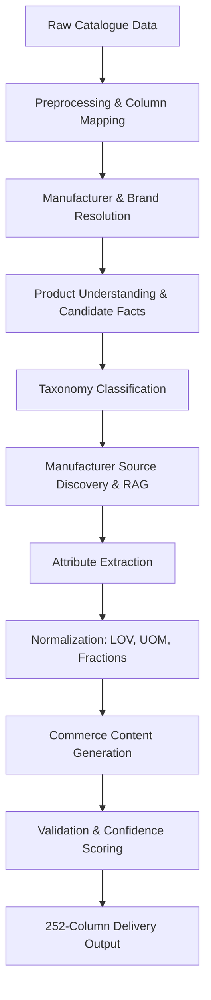

# 🏭 AI Product Intelligence Pipeline

<div align="center">
  <p><strong>Transforming messy industrial catalogue data into standardized, searchable, and commerce-ready product records.</strong></p>
</div>

---

## 📖 Overview

The **AI Product Intelligence Pipeline** is an end-to-end data processing and intelligence system that takes raw, unstructured product catalog data and enriches it into a verified 252-column commerce-ready delivery format. 

This project tackles the challenge of messy industrial product descriptions by passing them through a three-stage intelligent pipeline:

1. **🧠 Product Intelligence:** Entity resolution, classification, and Retrieval-Augmented Generation (RAG) to discover and pull data from manufacturer sources.
2. **🛡️ Data Normalization & Validation:** Deterministic validation against strict rule-based engines (UOM standards, fractional limits, Lists of Values), ensuring high confidence scoring.
3. **✨ Content Generation & Presentation:** Translating verified facts into commerce-ready, human-readable descriptions, showcased in an intuitive Next.js Review UI.

## 🏗️ Architecture

The pipeline follows a robust, multi-layered architecture:



## 🛠️ Tech Stack

- **Core & Data Processing:** Python 3.10+, pandas
- **Document Processing (RAG):** PyMuPDF (`fitz`)
- **AI & LLM Orchestration:** Anthropic/OpenAI APIs (via Instructor), Pydantic for structured extraction
- **API Backend:** FastAPI, SQLite, Uvicorn
- **Frontend / Review UI:** Next.js 14, React, Tailwind CSS

## 🚀 Getting Started

### Prerequisites

- **Python 3.10+**
- **Node.js 18+** & npm
- Valid LLM API Keys (Groq / Anthropic / OpenAI)

### 1. Installation & Backend Setup

Clone the repository and set up your Python environment:

```bash
git clone https://github.com/your-org/AI-Product-Intelligence.git
cd AI-Product-Intelligence

# Create and activate a virtual environment
python -m venv venv
# On Windows:
venv\Scripts\activate
# On macOS/Linux:
source venv/bin/activate

# Install dependencies
pip install -r requirements.txt
```

### 2. Environment Configuration

Copy the example environment file and add your required API keys (e.g., Groq API key for LLM-assisted extraction).

```bash
cp .env.example .env
```
*Edit `.env` to configure your specific API keys.*

### 3. Frontend Setup

Install the dependencies for the Review UI:

```bash
cd frontend
npm install
cd ..
```

---

## 🚦 Usage Guide

The system can be used via its CLI pipeline for bulk processing, or interactively via the API and Frontend.

### 1. Running the CLI Pipeline

The core processing engine is executed via `run_pipeline.py`. It takes your raw input data and outputs the standardized 252-column CSV.

```bash
python run_pipeline.py \
    --input data/raw/input.csv \
    --output data/processed/output.csv \
    --master data/reference/UniCat_Manufacturer_and_Brand_List.xlsx \
    --limit 200 \
    --workers 5
```

**Parameters:**
- `--input`: Path to raw catalogue input CSV (requires 6 core columns)
- `--output`: Path to write the 252-column delivery CSV
- `--master`: Path to manufacturer/brand master reference data (optional)
- `--limit`: Only process the first N rows (useful for testing)
- `--workers`: Number of concurrent processing threads
- `--internal-json`: Optional path to dump the rich internal product JSON for frontend hydration.

*(Windows users can also use the provided `run_prod.ps1` helper script).*

### 2. Running the API Backend

To serve the processed data and interact with the intelligence endpoints, start the FastAPI server:

```bash
uvicorn api.main:app --reload
```

### 3. Running the Review UI

In a separate terminal, launch the Next.js frontend to visualize the pipeline results, review confidence scores, and interact with the data:

```bash
cd frontend
npm run dev
```
Navigate to `http://localhost:3000` in your browser.

---

## 🤝 Project Structure & Team Workflow

The repository is structured to support our vertical ownership model while maintaining strict integration points:

- `src/preprocessing/` - Data ingestion, column normalisation
- `src/rag/` - Source discovery, document parsing, retrieval
- `src/attributes/` - Schema definitions, LLM extraction mappers
- `src/normalization/` - Deterministic LOV, UOM, and fraction rules
- `src/validation/` - Rules engine, character limits, confidence scoring
- `src/pipeline/` - Orchestration (connecting AI, Normalisation, and Output)
- `frontend/` - Next.js UI for product review
